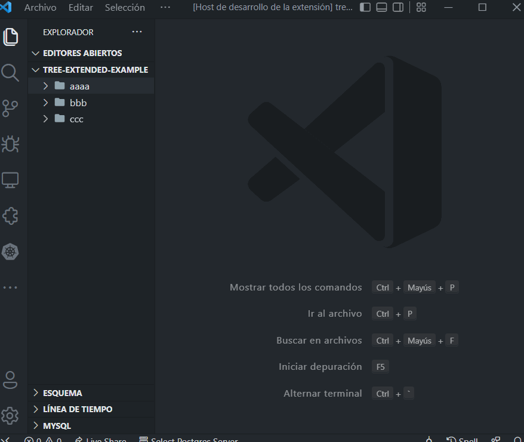
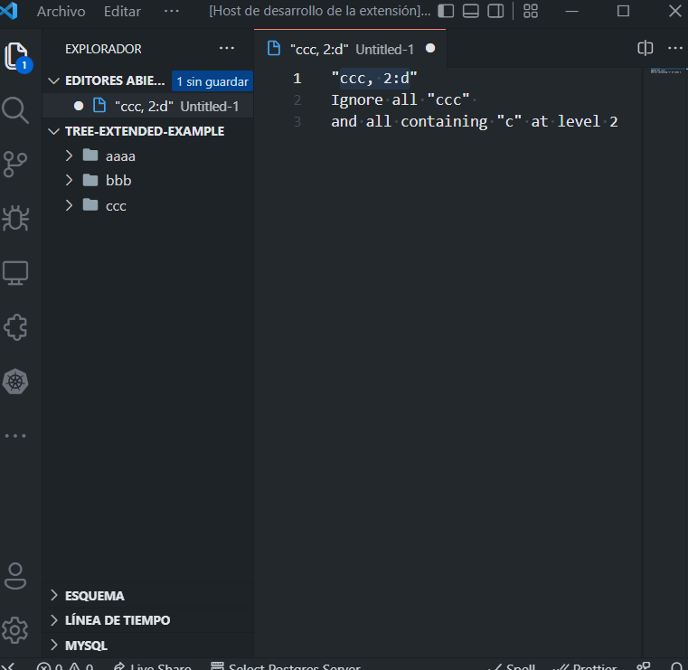
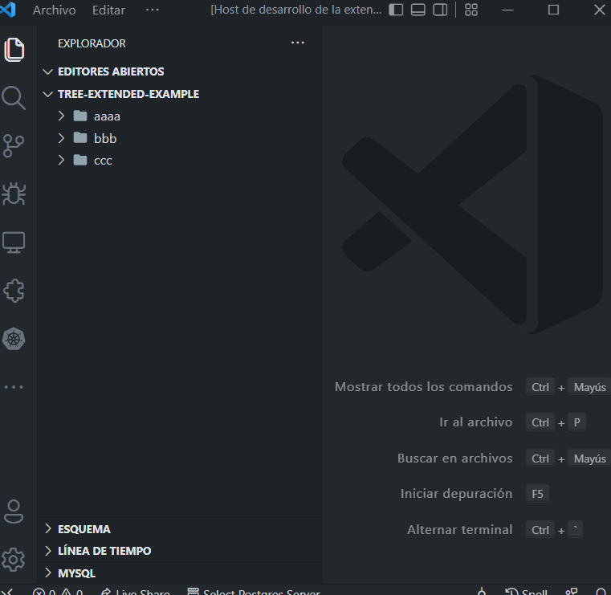
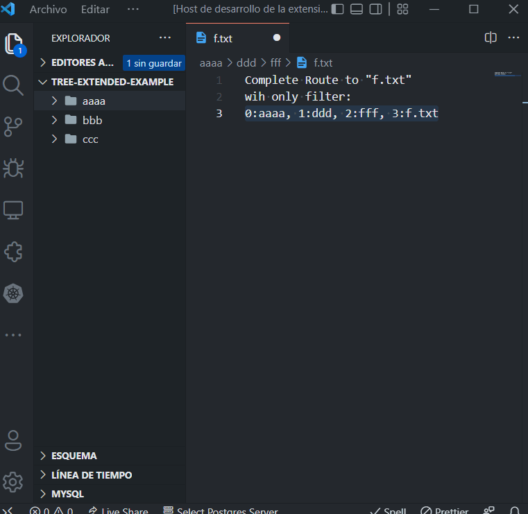
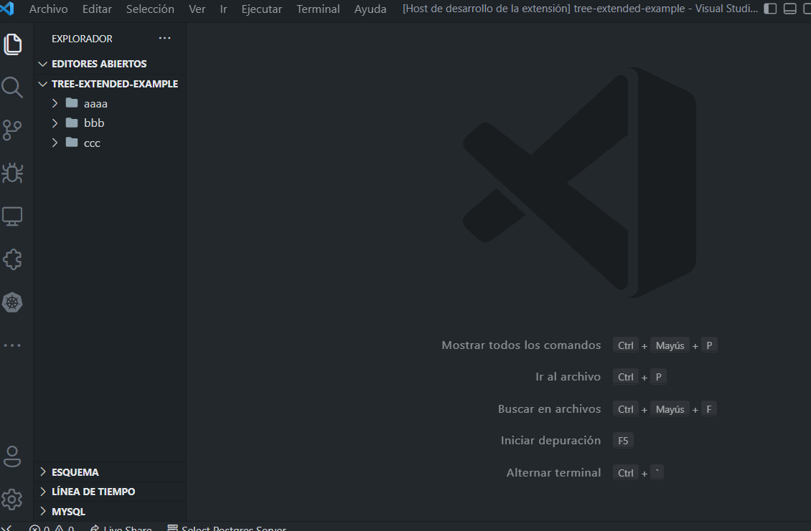
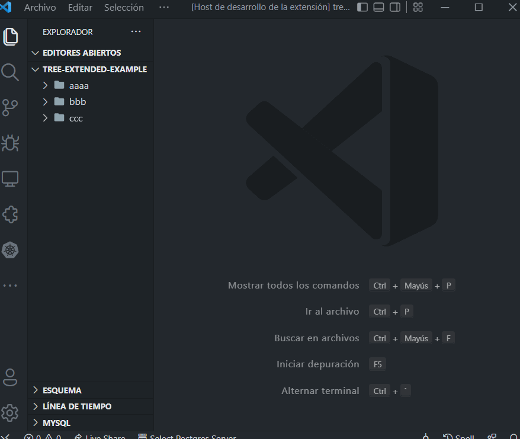

# tree-extended

This VSCode extension allows creating custom directory tries, by passing specific arguments.

For using it, just right click on any directory within you working space, and pick the `Get tree representation` menu item.

Then you can choose between 2 option:
1. Quick one (will use default configurations from the plugin settings)
2. Custom one (you can customize tree max deep and filters want to use)

> This extension generates `.tree` files, so these can be used with the [tree extension](https://marketplace.visualstudio.com/items?itemName=CTC.vscode-tree-extension)

## How to use it

To just using the extension quickly, click on any folder in the working directory, pick the `Get tree representation` menu item, and then click `No` when ask you if want to use custom configuration:

But also you can customize the following things:
- Tree's maximum deep
- Filter to IGNORE directories and file matching pattern
- Filter to ONLY choose directories and files matching pattern
- Charset to use. We can choose between `ascii`, `utf-8` and `utf-8` with icons (default). This is a plugin configuration.
- If want to ignore items by using the `.gitignore` file. This is a plugin configuration.
- If we want to show some indicator if directory is empty or not when we get at the maximum tree level. We can show `...` or nothing. This is a plugin configuration. 

## Tree's deep

The first custom configuration that we can use is a number meaning the maximum deep of the tree we want  get. By default it will take the value from the plugins settings (`Default Max Level`).

## Ignore filter

The second custom configuration that we can use is a text filter to indicate the items we want to ignore from the directory tree.

We can set global filters or filter by level. For example, in this filter `aa, bb, 0:ddd, 2:file`, we want to say: exclude items matching `aa` and `bb`, also exclude all matching `ddd` at level `0`, and all matching `file` at level `2`.

In the following image we ignore all items matching the pattern `d`:

And here we apply the ignore filter by specifying `ccc, 2:d`, meaning "exclude all items matching `ccc` and all items matching `d` in the second level of the tree":

## Only filter

The third custom configuration is a text filter to indicate that we ONLY want to get items matching this filter.

We can define this in the same way than we do with the `Ignore Filter`. In this way, `aa, bb, 0:ddd, 2:file` means: we want ONLY items matching `aa` and `bb`, but also in level 0 can include items matching `ddd` and in level 2 can include items matching `file`.

In this example we only want items matching `b, d, c` patterns:

In this example we got the complete route to a file:

## Show not-empty directory indicator

By default we show three dots (`...`) when we got the maximum directory deep in the tree and the directory is not empty. We can change this to show nothing:

## Charset

We can change the charset to use to generate the tree in the plugin configuration:

## Ignoring .gitignore

We can decide if ignore items (or not) in the `.gitignore` file by changing the plugin configurations:

## Requirements

This extensions is implemented by using the library [tree-extended](https://github.com/rulyotano/tree-extended). You can check it to find a more detailed documentation, and also, you can use it directly from your terminal by installing it globally as a npm package.

## Extension Settings

This extension contributes the following settings:

* `treeExtended.showNotEmptyDirectoryIndicator`: When the directory tree is pruned at the maximum deep we can show an indicator (`...`) which means the directory is not empty
* `treeExtended.charset`: Charset used to render the directory tree.
* `treeExtended.gitignore`: Ignore files and directories defined in the .gitignore file.
* `treeExtended.default.maxLevel`: The default maximum deep level the generated directory tree will have.
* `treeExtended.default.ignore`: Filter to exclude folders or files in an optional tree level, e.g.: 'window, 0:red cat, 1:blue sky'.
* `treeExtended.default.only`: Filter to only include folders or files in an optional tree level, e.g.: 'window, 0:red cat, 1:blue sky'.

## Known Issues

* Found issue with the ONLY filter: currently the global filters have priority over the filters defined by level, this means if we define global only filters, filters by level are going to be ignored. This need to be fixed in the library.
* Needs i18n translation to other languages.
* Pending to implement test.

## Release Notes

### 1.0.0

First Release! A working extensions that can be used to generate customized directory text tries. Has a known issue with the ONLY filters which give priority to global filters over level filters.